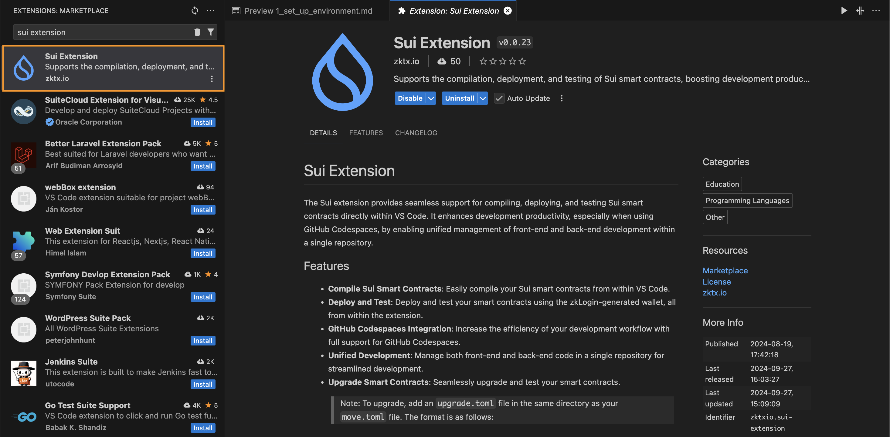

# Setup Development Environment

Welcome to the Sui Move introduction course. In this first unit, we will walk you through the process of setting up the development environment for working with Sui Move, and create a basic Hello World project as a gentle introduction into the world of Sui.

## Install Sui Binaries Locally

1. [Install prerequisites depending on your operating system](https://docs.sui.io/build/install#prerequisites)

2. Install Sui binaries
    
    `cargo install --locked --git https://github.com/MystenLabs/sui.git --branch devnet sui`

    Change the branch target here to `testnet` or `mainnet` if you are targeting one of those.

   *Linux Users: The installation process will create build artifacts in /tmp directory. If you encountered `disk out of space` related issues during installation. Make sure to expand your tmpfs to at least 11GB.*
    ```
   To check your tmpfs usage on Linux systems:
   
   df /tmp
   
   You can expand the tmpfs by editing the `/etc/fstab` file and setting the size of tmpfs to 20G:
   
   tmpfs          /tmp        tmpfs   noatime,size=20G,mode=1777   0 0
    ```

4. Check binaries are installed successfully:

    `sui --version`

    You should see the version number in the terminal if sui binaries were installed successfully. 

## Using a Docker Image with Pre-installed Sui Binaries

1. [Install Docker](https://docs.docker.com/get-docker/)

2. Pull  Sui official docker image

    `docker pull mysten/sui-tools:devnet`

3. Start and shell into the Docker container:

    `docker run --name suidevcontainer -itd mysten/sui-tools:devnet`

    `docker exec -it suidevcontainer bash`

*💡Note: If the above Docker image is not compatible with your CPU architecture, you can start with a base [Rust](https://hub.docker.com/_/rust) Docker image appropriate for your CPU architecture, and install the Sui binaries and prerequisites as described above.*

## (Optional) Configure VS Code with Move Analyzer Plug-in

1. Install [Move Analyzer plugin](https://marketplace.visualstudio.com/items?itemName=move.move-analyzer) from VS Marketplace

2. Add compatibility for Sui style wallet addresses:

    `cargo install --git https://github.com/move-language/move move-analyzer --features "address20"`

## (Optional) Configure VS Code with Sui Extension Plug-in

This tool allows you to easily build, test, and deploy smart contracts in VS Code with just a button click, without needing to use the Sui CLI directly. It's perfect for those who are not familiar with the Sui CLI or who want a more convenient way to deploy their contracts.



1. Install the [Sui Extension Plugin](https://marketplace.visualstudio.com/items?itemName=zktxio.sui-extension) from the VS Marketplace.

Make sure to use the Sui Extension developed by `zktx.io`.

2. Once installed, you'll see a Sui Extension tab in the sidebar, where you can easily perform tasks like building and deploying contracts, or checking Objects.


## Sui CLI Basic Usage

[Reference Page](https://docs.sui.io/build/cli-client)

### Initialization
- Enter `Y` for `do you want to connect to a Sui Full node server?` and press `Enter` to default to Sui Devnet full node
- Enter `0` for key scheme selection to choose [`ed25519`](https://ed25519.cr.yp.to/)

### Managing Networks

- Switching network: `sui client switch --env [network alias]`
- Default network aliases: 
    - localnet: http://0.0.0.0:9000
    - devnet: https://fullnode.devnet.sui.io:443
- List all current network aliases: `sui client envs`
- Add new network alias: `sui client new-env --alias <ALIAS> --rpc <RPC>`
    - Try adding a testnet alias with: `sui client new-env --alias testnet --rpc https://fullnode.testnet.sui.io:443`

### Check Active Address and Gas Objects

- Check current addresses in key store: `sui client addresses`
- Check active-address: `sui client active-address`
- List all controlled gas objects: `sui client gas`

## Get Devnet or Testnet Sui Tokens

1. [Join Sui Discord](https://discord.gg/sui)
2. Complete verification steps
3. Enter [`#devnet-faucet`](https://discord.com/channels/916379725201563759/971488439931392130) channel for devnet tokens, or [`#testnet-faucet`](https://discord.com/channels/916379725201563759/1037811694564560966) channel for testnet tokens
4. Type `!faucet <WALLET ADDRESS>`
